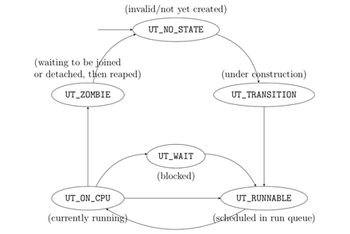

## uthread

一个用户级线程库，功能包括完整的线程创建/删除/joining，互斥锁，条件变量，以及一个基于优先级的调度器。

### 主要内容

使用线程库前首先要调用 `uthread_init()`。这个函数只执行一次，负责初始化数据结构，比如全局 `uthreads` 矩阵和 `ut_curthr` (这是当前正在执行的线程)。 `uthread_init()` 中有一些特殊的代码，处理当前正在执行的进程的上下文 (即调用 `uthread_init()`的进程)使其成为一个有效的 uthread 并设置 `ut_curthr`为这个uthread，这个uthread称之为主线程，0号线程。详见 `create_first_thr()` 附近的注释信息。所有事情初始化后，即`uthread_init`完成后，你可以使用线程 `uthread_create()`创建线程。

一旦创建好线程，线程库需要能够调度这些线程。线程需要暂时 yield 处理器给另一个线程 (仍然是可执行的，即处于就绪态)，则需要调用 `uthread_yield()`。 线程可以通过 `uthread_wake()` 被唤醒。选择另一个线程运行发生在 `uthread_switch()` 函数。调度器调度时，采用优先级调度算法，线程优先级可以由 `uthread_setprio()`设置，数字越大优先级越高，相同优先级的线程则轮流使用CPU。每个优先级一个队列，相关的数据结构见 `uthread_sched.c `中的`runq_table` 

Uthreads中的线程有6种状态，定义如下：

```c
typedef enum  {
    UT_NO_STATE,        /* 无效的线程状态 */
    UT_ON_CPU,          /* 线程正在执行 */
    UT_RUNNABLE,        /* 线程可运行，就绪 */
    UT_WAIT,            /* 线程被阻塞 */
    UT_ZOMBIE,          /* 线程处于 zombie 状态，即已结束，但需要回收资源 */
    UT_TRANSITION,      /* 线程处于创建状态 */    
    UT_JOINABLE,           //线程结束时需要一个线程回收其资源
    UT_DETACHABLE,          //线程结束时，不需要一个线程回收其资源 
    UT_NUM_THREAD_STATES    //线程状态数目
} uthread_state_t;
```



### 使用方法

见`test.c`文件

```c
#include <assert.h>
#include <stdio.h>
#include <stdlib.h>
#include <unistd.h>
#include <string.h>

#include "uthread.h"
#include "uthread_mtx.h"
#include "uthread_cond.h"
#include "uthread_sched.h"

#define NUM_THREADS 16

#define SBUFSZ 256

uthread_id_t    thr[NUM_THREADS];
//uthread_mtx_t   mtx;
//uthread_cond_t  cond;

static void tester(long a0, char *a1[]) {
    int i = 0;
    while (i < 10)    {

        printf("第 %i 个线程，第%i 次循环\n", uthread_self(), i++);
        uthread_yield();
        int j, k = 100000000;
        for (j = 0; j < 1000000; j++) {
            k /= 3;
        }
    }
    printf("第 %i 个线程结束.\n", uthread_self());
    uthread_exit((void *)a0);
}

int main(int ac, char **av) {
    int i;
    
    uthread_init();

    for (i = 0; i < NUM_THREADS; i++)     {
        uthread_create(&thr[i], tester, i, NULL, 0);//最后一个参数是优先级
    }
    uthread_setprio(thr[3], 2);

    for (i = 0; i < NUM_THREADS; i++)     {
        char pbuffer[SBUFSZ];
        int ret;
        void *tmp;

        uthread_join(thr[i], &tmp);
        sprintf(pbuffer, "joined with thread %i, exited %li.\n", thr[i], (long)tmp);
        ret = write(STDOUT_FILENO, pbuffer, strlen(pbuffer));
        if (ret < 0)         {
            perror("uthreads_test");
            return EXIT_FAILURE;
        }
    }
    uthread_exit(0);
    return 0;
}
```

